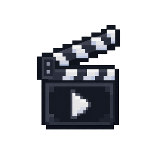

  

<h1 align="center">Mine-canvas</h1>

Экраны с видео прямо в мире Minecraft: серверный плагин хранит экраны и таймлайн, а мод скачивает ролик через `yt-dlp` + `ffmpeg` в `mine-canvas-cache/`, декодирует и рисует его на выбранной поверхности.

## Как работает

- Fabric-мод скачивает ролик в кэш, декодирует программно и рисует на экране; повторный показ и перемотка работают без сети.
- Мод синхронизируется с серверным временем; источники — **RuTube** и **VK**.

## Установка

| JAR | Minecraft | Loader | Fabric API | Java |
| --- | --- | --- | --- | --- |
| `mine-canvas-fabric-*-mc26.3.jar` → `mods/` | 26.3 | Fabric Loader ≥ 0.19.5 | ≥ 0.161.0 | 25 |
| `mine-canvas-fabric-*-mc26.2.jar` → `mods/` | 26.2 | Fabric Loader ≥ 0.18.4 | ≥ 0.156.0 | 25 |
| `mine-canvas-fabric-*-mc1.21.11.jar` → `mods/` | 1.21.11 | Fabric Loader ≥ 0.17.3 | 0.141.6+1.21.11 | 21 |

Mod Menu необязателен: рекомендуется 20.0.2 для 26.2, 21.0.0-beta.1 для 26.3 (доступен только prerelease) и 17.0.0 для 1.21.11.

Клиентская команда: `/minecanvas config`. Все команды `/film` находятся в репозитории серверного плагина.

Протокольные константы (`mine-canvas:main`, `mine-canvas:main_c2s`, `PROTOCOL_VERSION`) дублируются в репозитории серверного плагина; любое изменение протокола нужно применить в обоих.

## Сборка и релизы

| Модуль | Что это | Minecraft | Java |
| --- | --- | --- | --- |
| `mine-canvas-fabric-mc26.3` | мод для клиента | 26.3 | 25 |
| `mine-canvas-fabric-mc26.2` | мод для клиента | 26.2 | 25 |
| `mine-canvas-fabric-1.21.11` | мод для клиента | 1.21.11 | 21 |
| `mine-canvas-fabric-modern` | общие современные исходники для модулей 26.x (не Gradle-модуль) | 26.x | 25 |
| `mine-canvas-fabric-common` | общие исходники мода (не Gradle-модуль) | — | — |

- Общая логика мода (плеер, декодер, резолвер RuTube/VK, кэш, сеть, миксины) и общие ресурсы лежат в `mine-canvas-fabric-common`; современные общие исходники — в `mine-canvas-fabric-modern`.
- В модулях версий остаётся только код, зависящий от API конкретной версии Minecraft; общая логика подключается через `sourceSets`.
- Если одной версии Minecraft нужен другой код, поместите класс в `src/main/java` её модуля и удалите идентичный класс из `mine-canvas-fabric-modern/src/main/java`: оба вызовут ошибку дублирующего класса; общее дерево остаётся значением по умолчанию.
- Для новой версии клиента 26.x создайте `mine-canvas-fabric-mc<VER>/` с `gradle.properties` и 4-строчным `build.gradle`, затем добавьте одну строку `include(...)` в `settings.gradle`; общие исходники, CI и корневая сборка не меняются.
- `./gradlew build` собирает три мода; CI публикует их при пуше в `main`.

Для повседневной работы есть `Makefile`: `make` показывает команды, `make build` собирает всё, `make jars` кладёт готовые JAR в `build/libs`.
